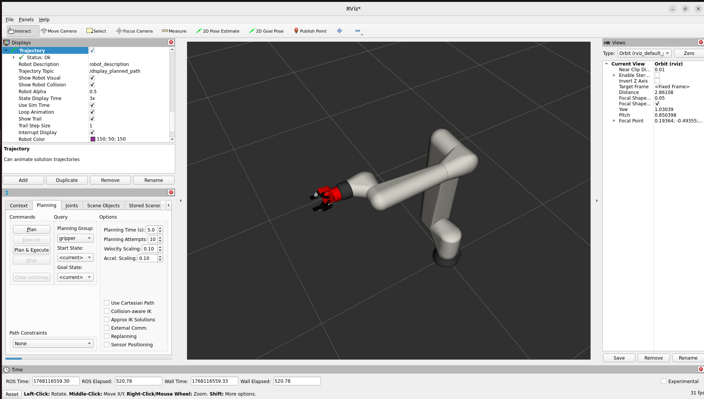
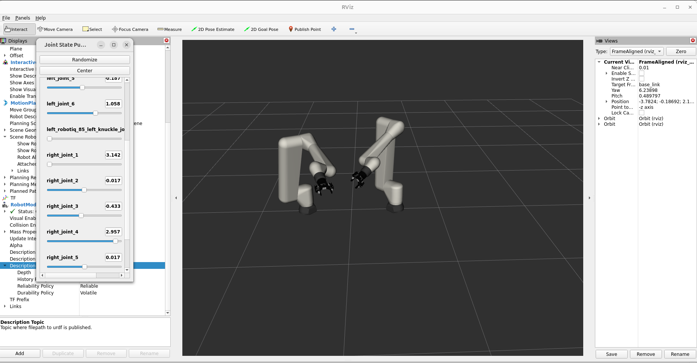

# Fanuc CRX-10iA Dual-Arm Manipulation (ROS 2 Humble)

## Project Overview
This repository implements a dual-arm robotic setup using two **Fanuc CRX-10iA** robots with **Robotiq 2F-85** grippers. The system is built on **ROS 2 Humble** and uses **MoveIt 2** for motion planning and trajectory execution.



## Key Features
* **Dual-Arm Configuration:** Two robots mounted at 45° relative to the world frame.
* **Gripper Integration:** Integrated Robotiq 2F-85 grippers with custom URDF/Xacro macros.
* **Simulation Ready:** Uses `mock_components/GenericSystem` for full simulation without hardware.
* **MoveIt 2 Support:** Configured planning groups, collision matrices, and trajectory controllers.

## Evaluation Tasks
* **Task 1:** Single Robot Setup & Gripper Integration (Completed).
* **Task 2:** Dual-Arm System Setup (Completed).

## Native Installation

### Prerequisites
* Ubuntu 22.04 (Jammy Jellyfish)
* ROS 2 Humble Hawksbill

### Build Instructions
```bash
# 1. Clone the repository
mkdir -p ~/ws/src
cd ~/ws/src
git clone https://github.com/srinjoy-not-007/fanuc_dual_arm_ros2.git .

# 2. Install dependencies
cd ~/ws
rosdep install --from-paths src --ignore-src -r -y

# 3. Build the workspace
colcon build --symlink-install
source install/setup.bash
```

## Usage

### 1. Launch Single Robot (Task 1)
Launches the Fanuc Arm + Robotiq Gripper with MoveIt.
```bash
ros2 launch dexsent_moveit_config demo.launch.py
```

### 2. Launch Dual-Arm Setup (Task 2)
Visualizes two robots mounted at 45-degree angles.
```bash
ros2 launch dexsent_moveit_config view_dual_arm.launch.py
```

#### Enabling Cartesian Control in RViz

1. Set Fixed Frame to world

2. Open the MotionPlanning panel

3. Select left_arm or right_arm under Planning Group

4. Drag the interactive marker to move the arm in Cartesian space

## 🐳 Docker Setup (Recommended)

This project was developed and tested inside a **Docker container** to ensure a consistent and reproducible environment. This is the **recommended** setup method.

### Run the Container

To enable RViz visualization, X11 forwarding must be enabled.

#### For Linux Users

```bash
xhost +local:root
docker run -it \
    --name fanuc_ros2 \
    --env="DISPLAY" \
    --env="QT_X11_NO_MITSHM=1" \
    --volume="/tmp/.X11-unix:/tmp/.X11-unix:rw" \
    osrf/ros:humble-desktop
```
### Set Up the Workspace Inside Docker

Once inside the container terminal:

```bash
# Update and install required tools
apt-get update && apt-get install -y \
    git \
    python3-colcon-common-extensions \
    python3-rosdep

# Create workspace
mkdir -p ~/ws/src
cd ~/ws/src

# Clone the repository
git clone https://github.com/srinjoy-not-007/fanuc_dual_arm_ros2.git .

# Install dependencies
cd ~/ws
rosdep update
rosdep install --from-paths src --ignore-src -r -y

```


## Technical Approach
* **Modular URDF:** The robot description is built using modular Xacro macros, allowing for easy addition of grippers and multiple arms.
* **Fake Hardware Interface:** To solve the lack of physical hardware, a custom `ros2_control` hardware interface using `mock_components/GenericSystem` was implemented for both the Fanuc arm and Robotiq gripper.
* **Controller Mismatch Fix:** Aligned the Robotiq Xacro parameter list to match the upstream library requirements, resolving build crashes.

## Authors
* **Name:** SRINJOY GANGULY
* **Affiliation:** IIT Kharagpur


